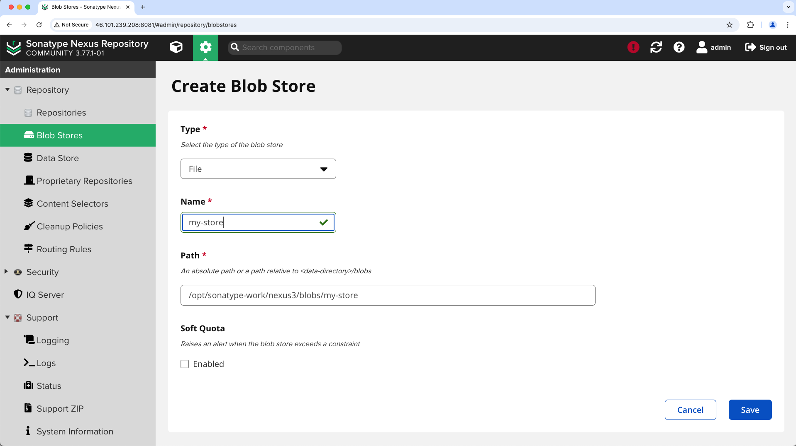
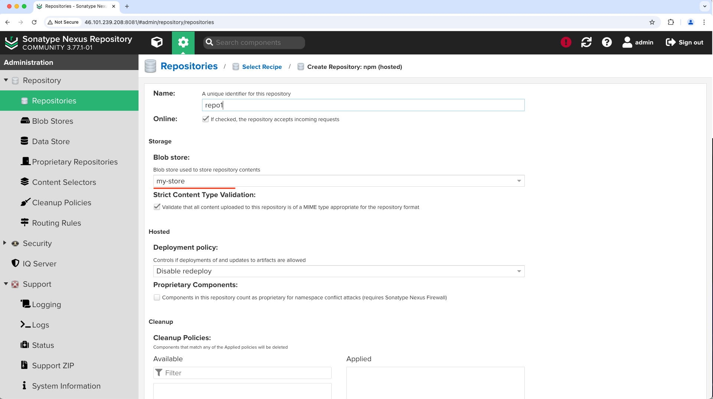
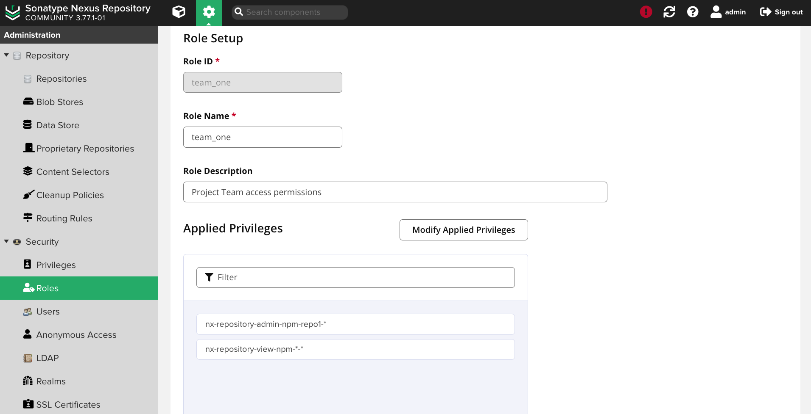
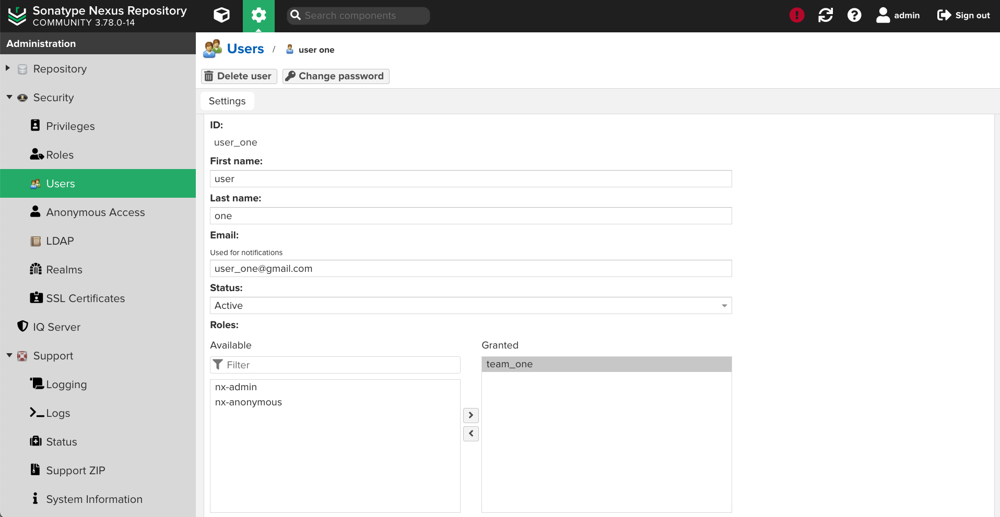
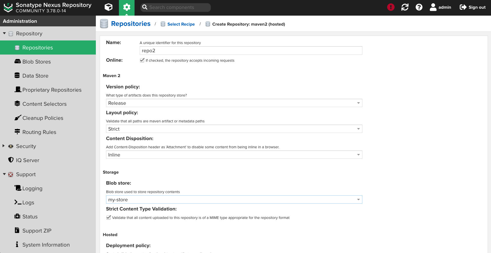
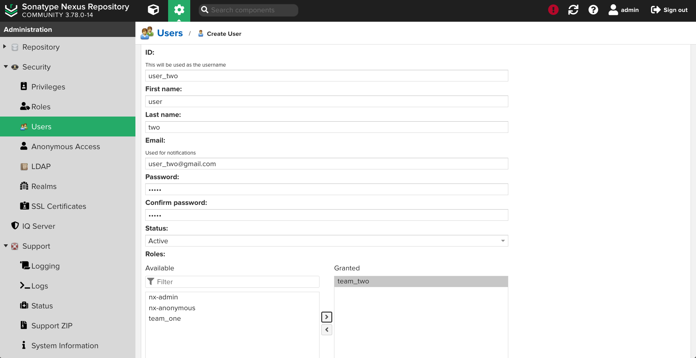
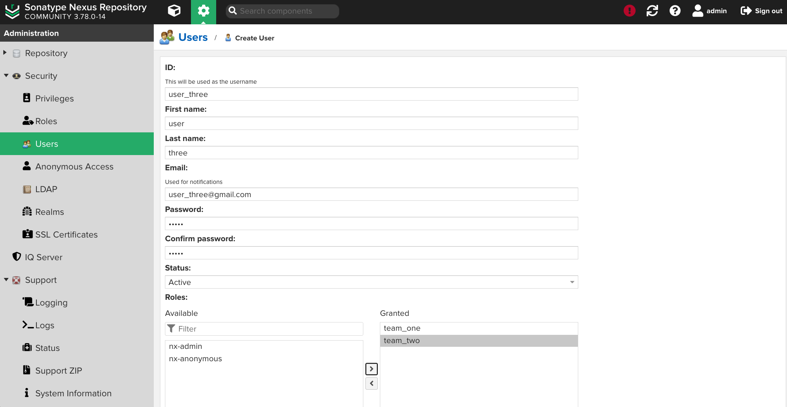
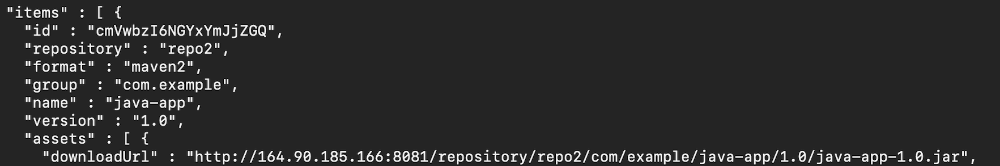
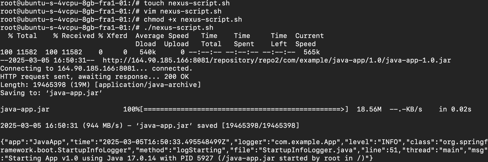

</details>

---

<details>
<summary>Exercise 1: Install Nexus on a server </summary>
 <br />

-   [Sonatype documentation](https://help.sonatype.com/en/download.html)

-   You can also use the [Nexus Docker image](https://hub.docker.com/r/sonatype/nexus3) if you prefer

</details>

---

<details>
<summary>Exercise 2: Create npm hosted repository </summary>
 <br />

-   Create a new Blob store



-   Create a new **npm (hosted)** repository that uses the new store



</details>

---

<details>
<summary>Exercise 3: Create user for team 1 </summary>
 <br />

-   Create a new role, which has `"nx-repository-admin-npm-repo1-*"` and `"nx-repository-view-npm-*-*"` Applied Privileges
    

-   Create a new user, and grant this new role to it



</details>

---

<details>
<summary>Exercise 4: Build and publish npm tar </summary>
 <br />

-   Clone the repository [found here](https://gitlab.com/twn-devops-bootcamp/latest/04-build-tools/node-app)
-   Run _npm pack_ command
-   Execute `npm login --registry=http://{nexus-ip}:8081/repository/{repo-name}/`
-   Execute `npm publish --registry=http://{nexus-ip}:8081/repository/{repo-name}/ {package-name}.tgz`

</details>

---

<details>
<summary>Exercise 5: Create maven hosted repository </summary>
 <br />

-   Create a new **maven2** repository which uses the blob store created in the earlier step

</details>

---

<details>
<summary>Exercise 6: Create user for team 2 </summary>
 <br />

-   Create a new role, which has `"nx-repository-admin-maven2-maven-central-*"` and `"nx-repository-view-maven2-*-*"` Applied Privileges
-   Create a new user, and grant this new role to it

</details>

---

<details>
<summary>Exercise 7: Build and publish jar file </summary>
 <br />

-   Clone the repository [found here](https://github.com/korngsamnang/devops-labs/tree/master/06-artifact-repository-with-nexus/java-app)
-   Your **build.gradle** file should contain the following, ensuring that the version is _not_ a snapshot and that your credentials are defined in a **gradle.properties** file:

```sh

plugins {
    id 'java'
    id 'org.springframework.boot' version '3.1.0-SNAPSHOT'
    id 'io.spring.dependency-management' version '1.1.0'
}

group 'com.example'
version '1.0.0'
sourceCompatibility = 17

apply plugin: 'maven-publish'

publishing {
    publications {
        mavenJava(MavenPublication) {
            artifact("build/libs/java-app-$version" + ".jar"){
              extension 'jar'
            }
        }
    }
    repositories {
        maven {
            name = "nexus"
            url = "http://{nexus-ip}:8081/repository/{repo-name}/"
            allowInsecureProtocol = true
            credentials {
                username project.repoUser
                password project.repoPassword
            }
        }
    }
}

repositories {
    mavenCentral()
    maven { url 'https://repo.spring.io/milestone' }
    maven { url 'https://repo.spring.io/snapshot' }
}

dependencies {
    implementation 'org.springframework.boot:spring-boot-starter-web'
    implementation group: 'net.logstash.logback', name: 'logstash-logback-encoder', version: '7.3'
    testImplementation group: 'junit', name: 'junit', version: '4.13.2'
    implementation "javax.annotation:javax.annotation-api:1.3.2"
}
```

-   Execute `gradle build` and then `gradle publish`
</details>

---

<details>
<summary>Exercise 8: Download from Nexus and start application </summary>
 <br />

-   Create a new user in the Nexus UI, and grant _both_ of the roles previously created to it
    
-   Execute `curl -u {user}:{password} -X GET 'http://{nexus-ip}:8081/service/rest/v1/components?repository={repo-name}&sort=version'` on the DigitalOcean droplet
-   Execute `wget` followed by the result of the previous command
    
-   Execute `java -jar java-app-1.0.jar`

</details>

---

<details>
<summary>Exercise 9: Automate </summary>
 <br />

-   Create a **.sh** file on the DigitalOcean droplet and ensure it has execute permissions
-   The **.sh** file should contain the following:

```sh
# save the artifact details in a json file
curl -u {user}:{password} -X GET 'http://{nexus-ip}:8081/service/rest/v1/components?repository={repo-name}&sort=version' | jq "." > artifact.json

# grab the download url from the saved artifact details using 'jq' json processor tool
artifactDownloadUrl=$(jq -r '.items[].assets[].downloadUrl | select(endswith(".jar"))' artifact.json)

# fetch the artifact with the extracted download url using 'wget' tool
wget --http-user={user} --http-password={password} "$artifactDownloadUrl" -O java-app.jar

# Run the Java application
java -jar java-app.jar
```

-   Execute the shell script on the server

</details>
